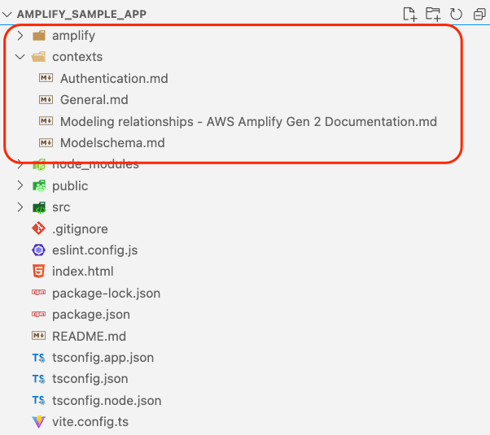

### README File

# Amplify Best Practices and Reference Guide

This repository provides comprehensive guides (**`amplify_contexts`**) designed to be used as context for Amazon Q Developer Chat in your IDE via the `@workspace` command. By integrating these guides, you can enhance Amazon Q's capabilities and accuracy in generating AWS Amplify Gen 2 code. The repository includes detailed instructions, examples, and best practices for:

- Data modeling techniques (e.g., one-to-many, one-to-one relationships)
- Schema rules for precise and error-free configuration
- Authentication setup with external providers and custom attributes
- Custom types and attributes for AWS Cognito

Using these guides as context ensures that Amazon Q has access to Amplify Gen 2 best practices, enabling it to provide more relevant and accurate code suggestions.

---

## How to Use

Below is an example of how to integrate the files into your project and use them for Amazon Q workspace context.

---


### Step 1: Create a New App

1. Run the following command to use Vite to create a React application::

   ```bash
   npm create vite@latest amplify_sample_app   -- --template react-ts -y 
   cd amplify_sample_app
   npm install
   ```

2. Open the project in Visual Studio Code:

   ```bash
   code . -r
   ```

---

### Step 2: Add the Folder to Your Project

1. Add AWS Amplify to your project by running the following command in your project root:

```bash
npm create amplify@latest -y
```

This will set up Amplify in your project and initialize the required configuration files.

1. Copy the (**`amplify_contexts`**) folder into the root folder of your project. The project structure should look like this:



This ensures that the markdown file is accessible and that Amplify is integrated into the project for any further development or configuration.

---

### Step 3: Enable Workspace Indexing and Verify File Indexing in Amazon Q

1. Open the Amazon Q Developer Chat in your IDE.

2. Type `@workspace` to enable workspace indexing. Amazon Q will guide you through enabling indexing for your project's directory. 


---

### Step 4: Use the File in Queries

After successful indexing, reference the markdown file content in your queries to Amazon Q. Examples:

```bash


@workspace use the amplify_contexts folder to follow the rules and point out where you use it:Design a data schema for an e-commerce app using Amplify Gen 2. Include models for products, categories, orders, and users. Provide API usage example to show how to fetch products for an e-commerce app using Amplify Gen 2

```


---

